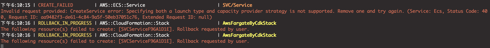
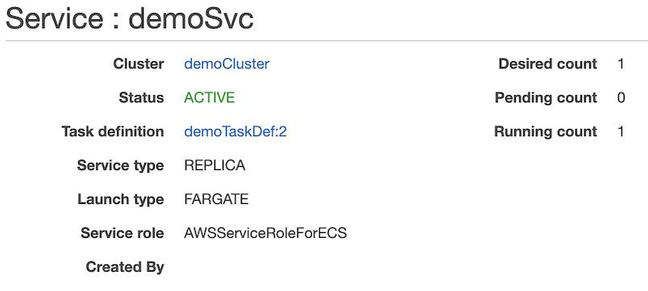
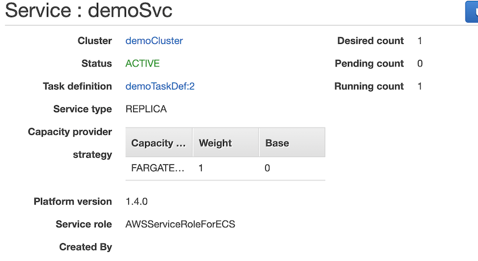

# issue
- [ ] : 如何設定上傳 ECR 的 Image 名稱?


## ECS, Service, Fargate_Spot 問題

- 在設定 fargate_spot 時, 出現問題



- 如果先將以下設定關閉, 進行部署, 再打開, 再部署, 則不會有問題

```
// set ecs service strategy
const strategy = [{ capacityProvider: "FARGATE_SPOT", weight: 1 }];
const theFirst: ecs.CfnService = ecsSvc.node.children[0] as ecs.CfnService;
theFirst.addPropertyOverride("capacityProviderStrategy", strategy);
```

### before


### after

